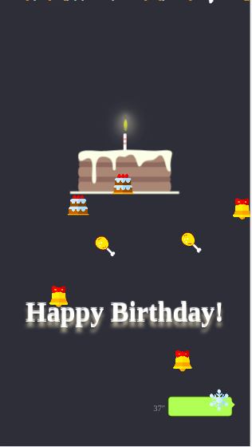

## Happy Valentine's Day
<p><a href="http://黄珊珊.com">demo</a></p>

A gift for my lover.

Refer to: <a href="https://github.com/hackerzhou/Love">hackerzhou</a>

## 七夕快乐
<p><a href="http://黄珊珊.com">演示地址</a></p>

送女票的七夕礼物。

创意部分参考 <a href="https://github.com/hackerzhou/Love">hackerzhou</a>

## 效果展示
<p align="center">
  
</p>
<p align="center">
  
</p>

## Start

``` javascript
npm install
npm run dev //开发模式
npm run build //构建

```

## 开发说明
* 所有开发均在app目录下，开发完毕后执行npm run build构建出 /index.html + /public 目录
* 如需要normal + birthday模式，请自行修改 app/js/getBirthday 中的日期，如只需要normal模式则不需要修改
* main.js为应用入口，对不同的模式做了按需加载
* 自行修改app/index.html title标签
* normal模式 ./js/normal(码字 + 倒计时 + 星星下落):
    + 为方便开发，开发状态下为快速打字，build后为demo所展示的速度
    + 修改go.js的startTime以及打字部分的文字（最好不改变行数，否则可能存在适配问题）
* birthday模式 ./js/birthday(蛋糕 + 语音):
    + 请修改./music/hb.mp3 ...(注意文件大小)
    + 修改birthday.js中的 vt(语音时间)


## TODO

* 重写 type-writer
* 生日模式写得比较急，代码需要整理
* 生日模式改成农历
* win环境下开发的路径/env问题